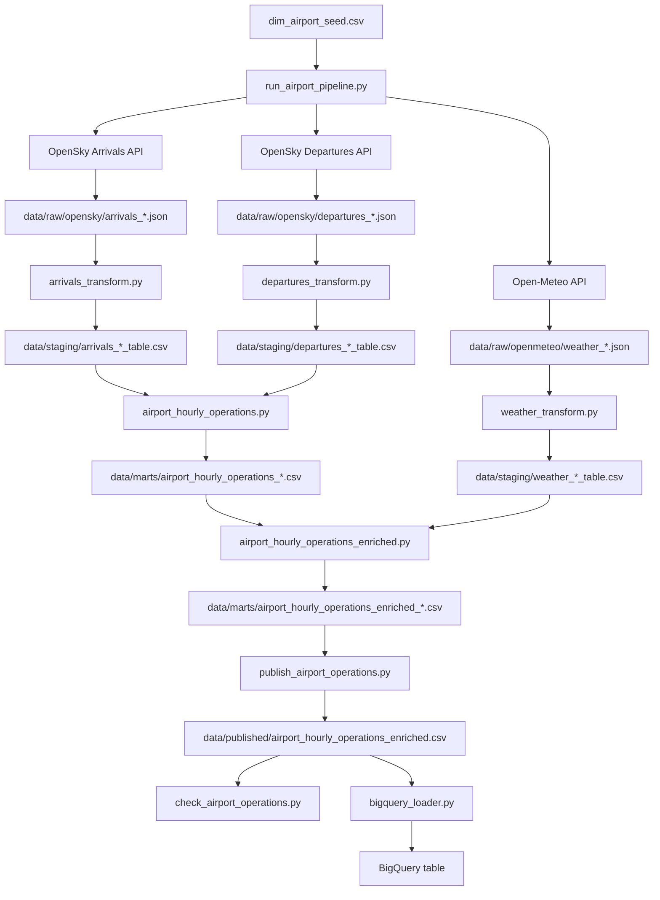

# Pipeline Architecture / Arquitectura del Pipeline

## ES — Visión general

Este proyecto construye un pipeline end-to-end de data engineering para monitorizar operaciones aeroportuarias observadas y enriquecerlas con datos meteorológicos horarios.

El pipeline:
- extrae datos de llegadas y salidas desde OpenSky
- extrae datos meteorológicos desde Open-Meteo
- guarda respuestas raw en JSON
- transforma los datos a tablas staging limpias
- construye tablas mart agregadas por aeropuerto y hora
- publica un dataset final consolidado
- ejecuta validaciones básicas de calidad de datos
- carga el dataset final en BigQuery

## ES — Diagrama de arquitectura

El siguiente diagrama resume el flujo completo del pipeline.

## ES — Objetivo técnico

El objetivo del proyecto es demostrar capacidades de data engineering mediante la construcción de un mini sistema de datos reproducible, parametrizable y extensible.

El sistema debe ser capaz de:
- ejecutar un pipeline completo para un aeropuerto y una fecha
- reutilizar el mismo flujo para múltiples aeropuertos
- publicar un dataset analítico listo para visualización o carga posterior a un data warehouse
- validar calidad básica antes de considerar el output final como confiable

## ES — Fuentes de datos

### 1. OpenSky
Fuente principal para movimientos observados de vuelos.

Se utilizan los endpoints:
- `flights/arrival`
- `flights/departure`

Estos endpoints permiten recuperar vuelos asociados a un aeropuerto dentro de un intervalo temporal.

### 2. Open-Meteo
Fuente meteorológica horaria.

Se utiliza para obtener:
- temperatura
- humedad relativa
- precipitación
- velocidad del viento

### 3. Seed local de aeropuertos
Archivo controlado dentro del proyecto con:
- ICAO
- IATA
- nombre
- ciudad
- país
- latitud
- longitud
- zona horaria

Este seed se utiliza para:
- acotar el scope del MVP
- buscar coordenadas para Open-Meteo
- validar qué aeropuertos forman parte del pipeline

## ES — Capas de datos

### 1. Seed layer
Contiene datos de referencia pequeños y controlados manualmente.

Ejemplo:
- `data/seeds/dim_airport_seed.csv`

### 2. Raw layer
Contiene respuestas originales de APIs sin transformar.

Formato:
- JSON

Ejemplos:
- `data/raw/opensky/arrivals_LEMD_2026-03-07.json`
- `data/raw/opensky/departures_LEBL_2026-03-07.json`
- `data/raw/openmeteo/weather_LEPA_2026-03-07.json`

### 3. Staging layer
Contiene tablas limpias y tipadas derivadas del raw.

Formato:
- CSV

Ejemplos:
- arrivals staging
- departures staging
- weather staging

### 4. Mart layer
Contiene tablas analíticas intermedias y finales a nivel de aeropuerto-hora.

Ejemplos:
- `airport_hourly_operations`
- `airport_hourly_operations_enriched`

### 5. Published layer
Contiene el dataset consolidado final listo para consumo analítico.

Ejemplo:
- `data/published/airport_hourly_operations_enriched.csv`

### 6. Warehouse layer
Contiene la tabla final cargada en BigQuery para consumo analítico posterior.

Ejemplo:
- `flightops.airport_hourly_operations_enriched`

## ES — Flujo del pipeline

### 1. Input del usuario
El pipeline recibe:
- `airport_icao`
- `date`

### 2. Lookup de metadata del aeropuerto
Se consulta el seed local para obtener:
- latitud
- longitud
- atributos básicos del aeropuerto

### 3. Construcción de ventana temporal
La fecha de entrada se transforma a:
- `begin` Unix timestamp UTC
- `end` Unix timestamp UTC

### 4. Extracción raw
Se descargan:
- llegadas desde OpenSky
- salidas desde OpenSky
- clima horario desde Open-Meteo

### 5. Transformación staging
Cada fuente se transforma a una tabla limpia:
- arrivals
- departures
- weather

### 6. Construcción de mart operativa
Se agregan arrivals y departures para construir:
- una fila por aeropuerto y hora
- métricas de actividad observada

### 7. Enriquecimiento meteorológico
La mart operativa se une con la tabla de clima horario.

### 8. Derivación de flags
Se calculan columnas derivadas como:
- `is_rainy_hour`
- `is_high_wind_hour`
- `is_high_traffic_hour`

### 9. Publicación
Los resultados por aeropuerto y fecha se consolidan en un único dataset published.

### 10. Data quality checks
El dataset published se valida con checks básicos antes de considerarlo output final correcto.

### 11. Carga a BigQuery
El dataset publicado se carga en una tabla final de BigQuery para su consumo posterior.

## ES — Selección de campos de OpenSky

Para el MVP, se seleccionan únicamente los campos mínimos necesarios para construir una tabla de movimientos observados por aeropuerto y hora.

### Campos usados
- `icao24`
- `callsign`
- `firstSeen`
- `lastSeen`
- `estDepartureAirport`
- `estArrivalAirport`

### Campos excluidos por ahora
- `estDepartureAirportHorizDistance`
- `estDepartureAirportVertDistance`
- `estArrivalAirportHorizDistance`
- `estArrivalAirportVertDistance`
- `departureAirportCandidatesCount`
- `arrivalAirportCandidatesCount`

### Justificación
Los campos seleccionados permiten:
- identificar aeronaves y vuelos observados
- asociar movimientos a aeropuertos
- derivar referencias temporales operativas
- construir agregaciones horarias

Los campos de distancia y número de candidatos se dejan fuera en esta versión para evitar complejidad adicional y porque no son estrictamente necesarios para el dataset analítico principal.

## ES — Tablas principales

### `arrivals_*_table.csv`
Tabla staging de llegadas observadas.

Campos principales:
- `icao24`
- `callsign`
- `arrival_airport_icao`
- `observed_arrival_time_utc`
- `observed_arrival_hour_utc`

### `departures_*_table.csv`
Tabla staging de salidas observadas.

Campos principales:
- `icao24`
- `callsign`
- `departure_airport_icao`
- `observed_departure_time_utc`
- `observed_departure_hour_utc`

### `weather_*_table.csv`
Tabla staging meteorológica horaria.

Campos principales:
- `airport_icao`
- `weather_hour_utc`
- `temperature_2m_c`
- `relative_humidity_2m_pct`
- `precipitation_mm`
- `wind_speed_10m_kmh`

### `airport_hourly_operations`
Mart operativa agregada por aeropuerto y hora.

Campos principales:
- `airport_icao`
- `operation_hour_utc`
- `observed_arrivals_count`
- `observed_departures_count`
- `total_flights_observed`

### `airport_hourly_operations_enriched`
Mart enriquecida con clima y flags derivados.

Campos principales:
- métricas operativas
- métricas meteorológicas
- flags derivados

### `airport_hourly_operations_enriched.csv`
Dataset published consolidado final.

### `flightops.airport_hourly_operations_enriched`
Tabla final cargada en BigQuery.

## ES — Supuestos y limitaciones

### 1. Observed operations vs exact operations
Los campos `firstSeen` y `lastSeen` de OpenSky no representan necesariamente la hora exacta real de salida o llegada.

En este proyecto:
- `firstSeen` se usa como proxy de salida observada
- `lastSeen` se usa como proxy de llegada observada

Por tanto, el dataset modela actividad observada por la red, no horarios oficiales exactos.

### 2. Batch, no real-time
El pipeline actual es batch y trabaja por fecha, no en tiempo real.

### 3. MVP acotado
El proyecto se ha construido inicialmente sobre un conjunto pequeño de aeropuertos españoles y una ventana temporal diaria.

### 4. Quality checks básicos
La validación actual cubre checks esenciales, pero no incluye todavía:
- freshness
- schema drift detection
- anomaly detection
- observability avanzada

## ES — Cómo ejecutar el pipeline

Ejemplo de ejecución:

    python -m src.run_airport_pipeline --airport-icao LEMD --date 2026-03-07

Ejemplo de publicación consolidada:

    python -m src.transform.publish_airport_operations

Ejemplo de quality checks:

    python -m src.quality.check_airport_operations

Ejemplo de carga a BigQuery:

    python -m src.load.bigquery_loader

---

## EN — Overview

This project builds an end-to-end data engineering pipeline to monitor observed airport operations and enrich them with hourly weather data.

The pipeline:
- extracts arrival and departure data from OpenSky
- extracts hourly weather data from Open-Meteo
- stores raw API responses as JSON files
- transforms data into clean staging tables
- builds mart tables aggregated by airport and hour
- publishes a consolidated final dataset
- runs basic data quality validations
- loads the final dataset into BigQuery

## EN — Architecture diagram

The following diagram summarizes the full pipeline flow.

## EN — Technical objective

The project aims to demonstrate data engineering capabilities by building a reproducible, parameterized, and extensible mini data system.

The system is designed to:
- run a full pipeline for one airport and one date
- reuse the same flow for multiple airports
- publish an analytical dataset ready for visualization or later warehouse loading
- validate basic quality rules before considering the final output reliable

## EN — Data sources

### 1. OpenSky
Main source for observed flight movements.

The pipeline uses:
- `flights/arrival`
- `flights/departure`

These endpoints return flights associated with an airport within a time interval.

### 2. Open-Meteo
Hourly weather data source.

Used to retrieve:
- temperature
- relative humidity
- precipitation
- wind speed

### 3. Local airport seed
A controlled seed file stored in the project containing:
- ICAO
- IATA
- airport name
- city
- country
- latitude
- longitude
- timezone

This seed is used to:
- define the MVP scope
- retrieve coordinates for Open-Meteo
- validate which airports belong to the pipeline

## EN — Data layers

### 1. Seed layer
Contains small, manually controlled reference data.

Example:
- `data/seeds/dim_airport_seed.csv`

### 2. Raw layer
Contains original API responses without transformation.

Format:
- JSON

Examples:
- `data/raw/opensky/arrivals_LEMD_2026-03-07.json`
- `data/raw/opensky/departures_LEBL_2026-03-07.json`
- `data/raw/openmeteo/weather_LEPA_2026-03-07.json`

### 3. Staging layer
Contains cleaned and typed tables derived from raw data.

Format:
- CSV

Examples:
- arrivals staging
- departures staging
- weather staging

### 4. Mart layer
Contains intermediate and final analytical tables at airport-hour grain.

Examples:
- `airport_hourly_operations`
- `airport_hourly_operations_enriched`

### 5. Published layer
Contains the final consolidated dataset ready for analytical consumption.

Example:
- `data/published/airport_hourly_operations_enriched.csv`

### 6. Warehouse layer
Contains the final table loaded into BigQuery for downstream analytical consumption.

Example:
- `flightops.airport_hourly_operations_enriched`

## EN — Pipeline flow

### 1. User input
The pipeline receives:
- `airport_icao`
- `date`

### 2. Airport metadata lookup
The local seed is used to retrieve:
- latitude
- longitude
- basic airport attributes

### 3. Time window construction
The input date is converted into:
- `begin` UTC Unix timestamp
- `end` UTC Unix timestamp

### 4. Raw extraction
The pipeline downloads:
- arrivals from OpenSky
- departures from OpenSky
- hourly weather from Open-Meteo

### 5. Staging transformation
Each source is transformed into a clean table:
- arrivals
- departures
- weather

### 6. Operations mart construction
Arrivals and departures are aggregated to build:
- one row per airport and hour
- observed activity metrics

### 7. Weather enrichment
The operations mart is joined with the hourly weather table.

### 8. Derived flags
Derived columns are calculated, such as:
- `is_rainy_hour`
- `is_high_wind_hour`
- `is_high_traffic_hour`

### 9. Publishing
Airport/date results are consolidated into a single published dataset.

### 10. Data quality checks
The published dataset is validated with basic checks before being considered a reliable final output.

### 11. BigQuery load
The published dataset is loaded into a final BigQuery table for downstream use.

## EN — OpenSky field selection

For the MVP, only the minimum required fields are selected to build an observed movements table by airport and hour.

### Fields used
- `icao24`
- `callsign`
- `firstSeen`
- `lastSeen`
- `estDepartureAirport`
- `estArrivalAirport`

### Fields excluded for now
- `estDepartureAirportHorizDistance`
- `estDepartureAirportVertDistance`
- `estArrivalAirportHorizDistance`
- `estArrivalAirportVertDistance`
- `departureAirportCandidatesCount`
- `arrivalAirportCandidatesCount`

### Justification
The selected fields make it possible to:
- identify observed aircraft and flights
- associate movements with airports
- derive operational time references
- build hourly aggregations

Distance fields and candidate-count fields are left out in this version to avoid extra complexity, since they are not strictly necessary for the main analytical dataset.

## EN — Main tables

### `arrivals_*_table.csv`
Observed arrivals staging table.

Main fields:
- `icao24`
- `callsign`
- `arrival_airport_icao`
- `observed_arrival_time_utc`
- `observed_arrival_hour_utc`

### `departures_*_table.csv`
Observed departures staging table.

Main fields:
- `icao24`
- `callsign`
- `departure_airport_icao`
- `observed_departure_time_utc`
- `observed_departure_hour_utc`

### `weather_*_table.csv`
Hourly weather staging table.

Main fields:
- `airport_icao`
- `weather_hour_utc`
- `temperature_2m_c`
- `relative_humidity_2m_pct`
- `precipitation_mm`
- `wind_speed_10m_kmh`

### `airport_hourly_operations`
Hourly operations mart aggregated by airport and hour.

Main fields:
- `airport_icao`
- `operation_hour_utc`
- `observed_arrivals_count`
- `observed_departures_count`
- `total_flights_observed`

### `airport_hourly_operations_enriched`
Weather-enriched mart with derived flags.

Main fields:
- operational metrics
- weather metrics
- derived flags

### `airport_hourly_operations_enriched.csv`
Final consolidated published dataset.

### `flightops.airport_hourly_operations_enriched`
Final table loaded into BigQuery.

## EN — Assumptions and limitations

### 1. Observed operations vs exact operations
OpenSky `firstSeen` and `lastSeen` fields do not necessarily represent exact real-world departure or arrival times.

In this project:
- `firstSeen` is used as a proxy for observed departure time
- `lastSeen` is used as a proxy for observed arrival time

Therefore, the dataset models network-observed activity, not exact official schedules.

### 2. Batch, not real-time
The current pipeline is batch-based and processes one date at a time, not real-time data.

### 3. Scoped MVP
The project was initially built around a small set of Spanish airports and a daily processing window.

### 4. Basic quality checks
The current validation layer covers essential checks, but does not yet include:
- freshness checks
- schema drift detection
- anomaly detection
- advanced observability

## EN — How to run the pipeline

Example pipeline execution:

    python -m src.run_airport_pipeline --airport-icao LEMD --date 2026-03-07

Example consolidated publishing step:

    python -m src.transform.publish_airport_operations

Example quality checks execution:

    python -m src.quality.check_airport_operations

Example BigQuery load:

    python -m src.load.bigquery_loader